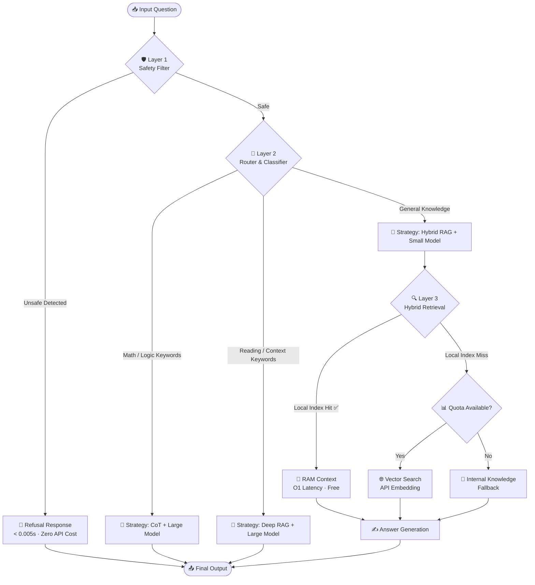

<div align="center">

# 🏆 VNPT AI Hackathon 2025 — Track 2

### Multi-domain Q&A System · Team **UIT_AeroNova**

[](https://python.org)
[](https://www.trychroma.com/)
[](https://www.docker.com/)
[](https://developer.nvidia.com/cuda-toolkit)

> **Giải pháp Hỏi đáp Đa lĩnh vực** với kiến trúc RAG Phân tầng (Hierarchical RAG) kết hợp Định tuyến Động (Dynamic Routing) — tối ưu hóa cho giới hạn **500 API requests/ngày**.

</div>

---

## 📋 Mục lục

- [Tổng quan](#-tổng-quan)
- [Kiến trúc hệ thống](#-kiến-trúc-hệ-thống)
- [Các chiến lược tối ưu hóa](#-các-chiến-lược-tối-ưu-hóa)
- [Xử lý dữ liệu](#-xử-lý-dữ-liệu)
- [Cấu trúc dự án](#-cấu-trúc-dự-án)
- [Hướng dẫn chạy](#-hướng-dẫn-chạy)
- [Thư viện sử dụng](#-thư-viện-sử-dụng)
- [Thông tin nhóm](#-thông-tin-nhóm)

---

## 🎯 Tổng quan

Repository này chứa mã nguồn giải pháp cho bài toán **Hỏi đáp Đa lĩnh vực** tại VNPT AI Hackathon 2025 — Track 2.

**Vấn đề cốt lõi cần giải quyết:**

> _"Làm sao để đạt độ chính xác cao nhất trên 2.000 câu hỏi test với giới hạn tài nguyên cực kỳ ngặt nghèo — chỉ 500 API requests/ngày?"_

**Hướng tiếp cận của chúng tôi:** Xây dựng một **Hệ thống RAG Phân tầng** kết hợp **Cơ chế Định tuyến Động**, ưu tiên độ trễ thấp và tiết kiệm tối đa API quota.

---

## 🏗️ Kiến trúc hệ thống

Hệ thống được thiết kế theo mô hình **Pipeline Tuần tự có Điều kiện (Conditional Sequential Pipeline)**, giúp tối ưu hóa tài nguyên cho từng loại câu hỏi.

### Sơ đồ luồng xử lý



### Chi tiết từng lớp xử lý

#### 🛡️ Lớp 1 — Safety Filter _(Zero Latency)_

| Đặc điểm | Mô tả |
|---|---|
| **Phương pháp** | Keyword Matching + Regex hai chiều |
| **Thời gian** | < 0.005 giây/câu hỏi |
| **Chi phí API** | **0%** (hoàn toàn cục bộ) |
| **Phạm vi phát hiện** | Nội dung chính trị, bạo lực, ma túy, tấn công mạng, v.v. |

Thay vì dùng LLM để kiểm tra safety (tốn chi phí, chậm), hệ thống sử dụng **thuật toán Keyword Matching + Regex** — kiểm tra đồng thời cả câu hỏi lẫn các đáp án "từ chối" tiềm năng.

#### 🧭 Lớp 2 — Question Router

Phân loại câu hỏi dựa trên đặc trưng ngôn ngữ học:

| Loại câu hỏi | Tiêu chí phân loại | Chiến lược xử lý |
|---|---|---|
| **MATH** | Từ khóa toán học, ký hiệu `$`, công thức | Large Model + Chain-of-Thought (CoT) |
| **READING** | Có đoạn văn dài (> 150 từ), `title:`, `content:` | Large Model + Deep RAG |
| **KNOWLEDGE** | Mặc định còn lại | Small Model + Hybrid RAG |

#### 🔍 Lớp 3 — Hybrid Retrieval _(Điểm sáng tạo chính)_

Chiến lược hai bước để vượt qua giới hạn 500 requests:

```
Bước 1 (Miễn phí · O(1)):  Tìm kiếm từ khóa trên Inverted Index trong RAM (BM25-like)
                            ✅ Nếu điểm khớp ≥ 3 → Dùng luôn, không tốn API

Bước 2 (Tốn quota):        Chỉ kích hoạt khi Bước 1 thất bại VÀ còn quota
                            → Gọi API Embedding để tìm kiếm ngữ nghĩa (Vector Search)
```

---

## 🚀 Các chiến lược tối ưu hóa

### 2.1 · Chiến thuật "One-File-One-Collection"

**Vấn đề:** RAG truyền thống gộp toàn bộ dữ liệu vào một Vector Store → truy xuất bị nhiễu (noise) khi các chủ đề khác nhau có từ khóa giống nhau.

**Giải pháp:**

```
1 File văn bản gốc  →  1 ChromaDB Collection riêng biệt
```

**Kết quả:** Khi câu hỏi đề cập đến văn bản cụ thể (ví dụ: _"Nghị định 100"_), hệ thống định vị chính xác Collection tương ứng, **loại bỏ hoàn toàn noise** từ các văn bản khác.

---

### 2.2 · Kỹ thuật "Double-Check" cho bài toán STEM

**Vấn đề:** LLM thường ảo giác hoặc tính toán sai số học.

**Giải pháp:** Prompt Engineering nâng cao (bằng tiếng Anh) yêu cầu mô hình:

1. Giải bài toán theo **2 phương pháp khác nhau** trong cùng một lần suy luận
2. **So sánh kết quả** trước khi đưa ra đáp án cuối cùng (Self-Consistency)

---

### 2.3 · Cơ chế "Robust Batching"

**Vấn đề:** Xử lý tuần tự quá chậm; xử lý song song dễ lỗi nếu một mẫu dữ liệu hỏng.

**Giải pháp — Smart Fallback:**

```
Mặc định → Batch Processing (tối đa tốc độ)
    ↓ Nếu Batch lỗi
Tự động → Sequential Fallback (chỉ cho Batch đó)
    ↓ Đảm bảo
Kết quả → Không bỏ sót câu hỏi nào
```

Cân bằng hoàn hảo giữa **Tốc độ** và **Độ ổn định**.

---

## 📦 Xử lý dữ liệu

### Nguồn dữ liệu

Knowledge Base được xây dựng từ các nguồn chính thống, đảm bảo tính pháp lý và độ chính xác:

| Lĩnh vực | Nguồn |
|---|---|
| ⚖️ Pháp luật | Thư viện Pháp luật, Cổng thông tin Chính phủ (Luật, Nghị định, Thông tư) |
| 📚 Bách khoa | Wikipedia Tiếng Việt (Lịch sử, Địa lý, Văn hóa) |
| 🔬 STEM | Công thức Toán học, Vật lý, Hóa học |
| 📡 Viễn thông | VNPT Official (Gói cước, Dịch vụ Vinaphone) |

### Tiền xử lý

- **Semantic Chunking:** Tách văn bản dựa trên cấu trúc ngữ nghĩa (định dạng `CHUNK x/y`) thay vì cắt theo số ký tự cố định → giữ nguyên vẹn ý nghĩa của các điều luật
- **Metadata Tagging:** Gán nhãn chủ đề (`Topic`) cho từng chunk để phục vụ Filtering khi truy vấn
- **Domain Mapping:** 20 lĩnh vực kiến thức được ánh xạ với bộ từ khóa đặc trưng

---

## 📁 Cấu trúc dự án

```
VNPT_AI_Track2_UIT_AeroNova/
│
├── 📄 Dockerfile               # Cấu hình Docker (base: nvidia/cuda:12.2.0)
├── 📄 requirements.txt         # Python dependencies
├── 📄 inference.sh             # Entry-point script cho Docker container
│
├── 🐍 build_db.py              # Xây dựng Vector Database từ knowledge_data.zip
├── 🐍 predict.py               # Pipeline chính: Safety → Route → Solve → Output
│
├── 📦 knowledge_data.zip       # Dữ liệu tri thức gốc (bắt buộc)
│
├── 📂 src/                     # Source code modules
│   ├── __init__.py
│   ├── api_client.py           # VNPT API wrapper (Rate Limit · Retry · Quota)
│   ├── config.py               # Cấu hình API endpoints & đường dẫn I/O
│   ├── router.py               # Phân loại câu hỏi (MATH / READING / KNOWLEDGE)
│   ├── solver.py               # Core Logic (Hybrid RAG · Safety · Batch Solving)
│   └── utils.py                # Tiện ích hỗ trợ
│
├── 📂 data/                    # Thư mục chứa file test đầu vào
│   └── private_test.json       # (Mount từ host khi chạy Docker)
│
└── 📂 output/                  # Thư mục kết quả đầu ra
    ├── submission.csv          # Kết quả dự đoán (qid, answer)
    └── submission_time.csv     # Kết quả + thời gian xử lý (qid, answer, time)
```

---

## ⚙️ Hướng dẫn chạy

### Yêu cầu hệ thống

- Docker với GPU support (NVIDIA Container Toolkit)
- CUDA 12.2+
- Ít nhất **8GB RAM** (để load toàn bộ knowledge vào bộ nhớ)

### Chạy với Docker _(Khuyến nghị)_

Hệ thống tự động thực hiện theo thứ tự: **Giải nén dữ liệu → Build Vector DB → Inference → Xuất kết quả**

```bash
# Bước 1: Build Docker Image
sudo docker build -t team_submission .

# Bước 2: Chạy Container
#   -v: Mount thư mục data và output từ máy host vào container
sudo docker run --gpus all \
  -v /absolute/path/to/data:/app/data \
  -v /absolute/path/to/output:/app/output \
  team_submission
```

| Path | Mô tả |
|---|---|
| **Input** | `/app/data/private_test.json` |
| **Output** | `/app/output/submission.csv` · `/app/output/submission_time.csv` |

### Chạy thủ công (Local)

```bash
# Bước 1: Cài đặt dependencies
pip install -r requirements.txt

# Bước 2: Build Vector Database (chỉ cần chạy lần đầu)
python build_db.py

# Bước 3: Chạy inference
python predict.py
```

> **💡 Lưu ý:** Nếu pipeline bị gián đoạn, chỉ cần chạy lại `python predict.py` — hệ thống sẽ tự động tiếp tục từ checkpoint cuối cùng.

---

## 📚 Thư viện sử dụng

| Thư viện | Phiên bản | Mục đích |
|---|---|---|
| `requests` | 2.31.0 | Gọi VNPT API |
| `pandas` | 2.0.3 | Xử lý dữ liệu bảng & I/O CSV |
| `numpy` | 1.24.4 | Tính toán vector |
| `chromadb` | 0.4.22 | Vector Database cục bộ |
| `sentence-transformers` | 2.2.2 | Xử lý embedding |
| `transformers` | 4.30.2 | NLP backbone |
| `torch` | 2.1.2+cu121 | Deep learning framework |
| `tqdm` | 4.66.1 | Hiển thị thanh tiến trình |
| `pysqlite3-binary` | latest | SQLite tương thích Linux/Docker |

---

## 👥 Thông tin nhóm

<div align="center">

| | |
|---|---|
| 🏫 **Trường** | Đại học Công nghệ Thông tin — ĐHQG TP.HCM (UIT) |
| 🤝 **Team Name** | UIT_AeroNova |
| 📧 **Contact** | 24521374@gm.uit.edu.vn |
| 🏆 **Competition** | VNPT AI Hackathon 2025 — Track 2 |

</div>

---

<div align="center">

_Giải pháp được tối ưu hóa hoàn toàn cho luật chơi và giới hạn tài nguyên của **VNPT AI Hackathon 2025**._
_Đảm bảo tính khả thi, hiệu quả và độ tin cậy cao nhất trong điều kiện 500 API requests/ngày._

</div>
